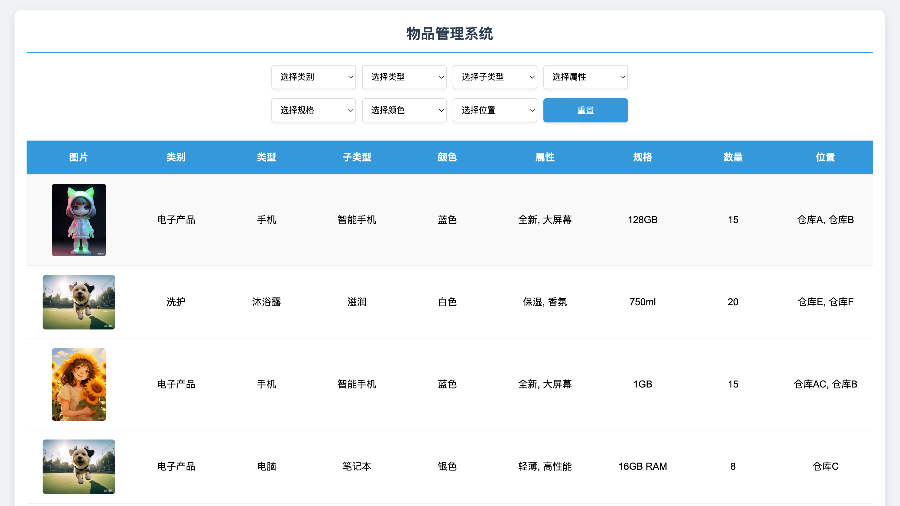
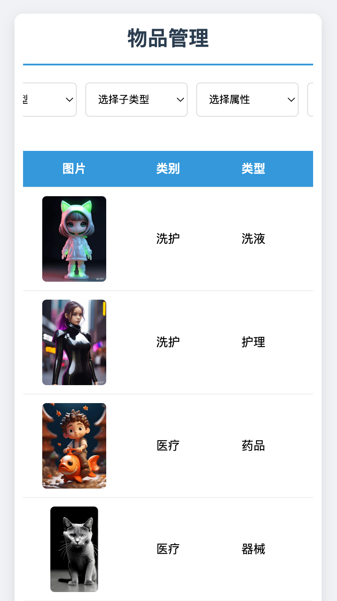

### 项目概述与特点

物品管理系统是一个基于 Web的应用程序，用户可以管理和筛选存储在 JSON 文件中的物品数据。该系统支持多级筛选功能（类别、类型、子类型、属性和颜色），并提供直观的表格展示，支持多重属性筛选和移动端优化。

* 多级筛选：支持通过类别、类型、子类型、属性和颜色逐步筛选物品。
* 多重属性支持：属性支持多选，使用“与”逻辑进行筛选，结果更精准。
* 响应式设计：页面适配桌面和移动设备，提供良好的用户体验。
* 数据驱动：所有数据存储于 JSON 文件，便于维护和扩展。
* 图片展示：支持展示物品图片，图片链接可自定义。


### 项目目录结构

```text
ItemManage/
├── public/
│   ├── styles.css    # CSS 样式文件
│   └── script.js     # JavaScript 逻辑文件
├── data/
│   ├── item.json     # 物品数据文件
│   └── label.json    # 分类数据文件
├── index.html        # 主页面
└── open.js           # 服务器代码
```


### 网页预览

|                            电脑端                            |             移动端             |
| :----------------------------------------------------------: | :----------------------------: |
|  |  |


### 运行

#### 使用 Node.js

> 1. 下载并安装 Node.js
>
> 2. 安装 http-server 
>
> 终端输入`npm install -g http-server`
>
> 或者终端直接输入`node open.js`(服务器代码已经提供)
>
> 3. 打开浏览器，输入`http://localhost:8080`，即可看到页面


#### 使用 VS Code 的 Live Server 扩展

> 1. 安装 VS Code
>
> - 下载地址：code.visualstudio.com

> 2. 安装 Live Server 扩展
> 
> - 打开 VS Code，点击左侧“扩展”图标（或按 Ctrl+Shift+X）
> 
> - 搜索 “Live Server”，安装由 Ritwick Dey 开发的扩展
> 
> 3. 运行服务器
> 
> - 打开index.html 文件
> 
> - 右键点击文件内容，选择 “Open with Live Server”
> 
> - 浏览器会自动打开，通常是 http://127.0.0.1:5500


### 未来想完成的功能

- [ ] 建立前端增删改数据
- [ ] 建立登陆界面
- [ ] 增删改数据和项目管理一体化


### 源码
GitHub：[ItemManageSystem](https://github.com/cimorn/ItemManageSystem)