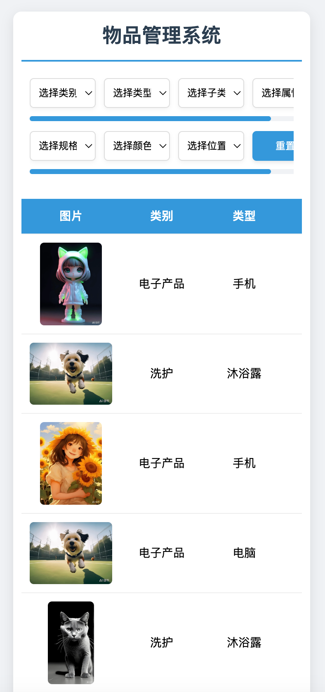

# 物品管理系统

这是一个基于 Web 的物品管理系统，支持用户登录、物品筛选和查看功能。系统使用 HTML、CSS 和 JavaScript 实现，前端通过 JSON 文件加载数据，支持桌面端和移动端的响应式设计。

查看详细更新记录，请点击 [CHANGELOG.md](CHANGELOG.md)。

## 项目概述与特点

物品管理系统是一个基于 Web 的应用程序，用户可以管理和筛选存储在 JSON 文件中的物品数据。该系统支持多级筛选功能（类别、类型、子类型、属性和颜色），并提供直观的表格展示，支持多重属性筛选和移动端优化。

- 多级筛选：支持通过类别、类型、子类型、属性和颜色逐步筛选物品。
- 多重属性支持：属性支持多选，使用“与”逻辑进行筛选，结果更精准。
- 响应式设计：页面适配桌面和移动设备，提供良好的用户体验。
- 数据驱动：所有数据存储于 JSON 文件，便于维护和扩展。
- 图片展示：支持展示物品图片，图片链接可自定义。

## 功能说明

### 主要功能

1. 用户登录
   - 用户通过用户名和密码登录，验证凭据后进入主界面。
   - 错误时显示提示信息。
     
   
2. 物品筛选
   - 支持多条件筛选：类别、类型、子类型、属性、颜色、位置、规格。
   - 属性、颜色、位置和规格支持多选，筛选条件实时更新物品列表。
   - 筛选框分两行：
     - 第一行：类别、类型、子类型、属性。
     - 第二行：颜色、位置、规格、重置按钮。

3. 物品列表展示
   - 按筛选条件显示物品信息，表格列顺序：图片、类别、类型、子类型、颜色、属性、规格、数量、位置。
   - 支持水平滚动（移动端）。

4. 图片预览
   - 点击物品图片可在模态框中放大查看，点击外部或关闭按钮退出。

5. 重置功能
   - 一键清空所有筛选条件，恢复初始物品列表。

### 响应式设计
- 桌面端（> 768px）：
  - 筛选框每行四元素，宽度 140-160px，居中对齐。
  - 表格字体 16px，单元格宽度 100px。
- 移动端（≤ 768px）：
  - 筛选框每行四元素，宽度固定 80px，支持左右滑动。
  - 表格字体 14px，单元格宽度 80px，图片尺寸 100x100px。


## 项目目录结构

```text
ItemManage/
├── public/
│   ├── styles.css    # CSS 样式文件
│   └── script.js     # JavaScript 逻辑文件
├── data/
│   ├── item.json     # 物品数据文件
│   ├── label.json    # 分类数据文件
│   └── password.json # 用户凭据数据文件
├── index.html        # 主页面
└── CHANGELOG.md      # 项目日志
└── README.md         # 项目说明文档
```


### 文件说明

- `data/item.json`：物品核心数据，包含图片路径、类别、类型等。

- `data/label.json`：筛选标签数据，定义类别、类型映射等。

- `data/password.json`：用户凭据，包含用户名和密码。

- `public/styles.css`：所有样式规则，支持响应式设计。

- `public/script.js`：所有逻辑代码，处理登录、筛选和展示。

- `index.html`：主 HTML 文件，包含登录和主内容结构。

  

## 网页预览

| 电脑端 | 移动端 |
| :----------------------------------------------------------: | :----------------------------: |
|  |  |


## 运行

### 使用 Node.js

1. 下载并安装 Node.js：
   - 前往 [nodejs.org](https://nodejs.org) 下载并安装。

2. 安装 http-server 或使用 open.js：
   - 安装 `http-server`：
     ```bash
     npm install -g http-server
     cd ItemManage
     http-server
     ```
   - 或直接使用提供的 `open.js`：
     ```bash
     cd ItemManage/public
     node open.js
     ```

3. 访问页面：
   - 打开浏览器，输入 `http://localhost:8080`，即可看到页面。


### 使用 VS Code 的 Live Server 扩展

1. 安装 VS Code：
   - 下载地址： [code.visualstudio.com](https://code.visualstudio.com)。

2. 安装 Live Server 扩展：
   - 打开 VS Code，点击左侧“扩展”图标（或按 `Ctrl+Shift+X`）。
   - 搜索 “Live Server”，安装由 Ritwick Dey 开发的扩展。

3. 运行服务器：
   - 打开 `index.html` 文件。
   - 右键点击文件内容，选择 “Open with Live Server”。
   - 浏览器会自动打开，通常是 `http://127.0.0.1:5500`。


## 添加自定义数据

可以通过编辑 `data/label.json` 和 `data/item.json` 文件来添加自定义数据。以下是具体步骤：

1. 编辑 `label.json`：
   - 添加新类别：在 `categories` 数组中添加新类别名称。
   - 添加类型：在 `typeMap` 中为新类别添加对应的类型。
   - 添加子类型：在 `subTypeMap` 中为新类型添加子类型。
   - 添加属性：在 `attributeMap` 中为新子类型添加可选属性。
   - 更新颜色或位置（可选）：在 `colors` 或 `locations` 数组中添加新值。

2. 编辑 `item.json`：
   - 添加新物品条目，确保每个字段与 `label.json` 中的定义匹配。
   - 字段包括：`image`、`category`、`type`、`subType`、`color`、`attribute`（数组）、`quantity`、`spec` 和 `location`。

3. 保存并重启服务器：
   - 保存文件后，重新运行 `node open.js` 或刷新 Live Server 页面以加载新数据。


### 示例

假设添加新类别“食品”，类型“饮料”，子类型“果汁”，并添加相关物品：

#### 修改 `label.json`
```diff
{
  "categories": [
    "电子产品", "服装", "体育",
+   "食品"
  ],
  "colors": ["红色", "蓝色", "黑色", "银色", "金色", "白色", "灰色", "深蓝", "浅蓝", "卡其色", "紫色", "绿色", "黄色", "军绿色", "粉色", "无色", "橙色"],
  "typeMap": {
    "电子产品": ["手机", "电脑"],
    "服装": ["上衣", "裤子"],
    "体育": ["球类", "健身", "户外"],
+   "食品": ["饮料"]
  },
  "subTypeMap": {
    "手机": ["智能手机", "功能机"],
    "上衣": ["T恤", "衬衫"],
    "户外": ["登山杖"],
+   "饮料": ["果汁"]
  },
  "attributeMap": {
    "智能手机": ["防水", "5G"],
    "T恤": ["短袖", "长袖"],
    "登山杖": ["轻便", "可折叠"],
+   "果汁": ["纯果汁", "无糖"]
  },
  "locations": ["仓库A", "仓库B"]
}
```

#### 修改 `item.json`
```diff
[
  {
    "image": "images/phone.jpg",
    "category": "电子产品",
    "type": "手机",
    "subType": "智能手机",
    "color": "红色",
    "attribute": ["防水", "5G"],
    "spec": "128GB",
    "quantity": 10,
    "location": ["仓库A"]
-  }
+  },
+  {
+    "image": "http://gips0.baidu.com/it/u=3602773692,1512483864&fm=3028&app=3028&f=JPEG&fmt=auto?w=960&h=1280",
+    "category": "食品",
+    "type": "饮料",
+    "subType": "果汁",
+    "color": "橙色",
+    "attribute": ["纯果汁", "无糖"],
+    "quantity": 30,
+    "spec": "1L",
+    "location": ["仓库CC"]
+  }
]
```

### 注意事项
- 字段一致性：确保 `item.json` 中的字段值在 `label.json` 中有对应定义。
- JSON 格式：保持正确的 JSON 语法，避免多余逗号或格式错误。
- 图片链接：使用有效 URL，若失效可替换为本地路径或占位图（如 `https://via.placeholder.com/120`）。


## 数据格式要求

### `data/password.json`
```json
{
  "users": [
    {
      "username": "admin",
      "password": "123456"
    }
  ]
}
```


### `data/label.json`
```json
{
  "categories": ["电子产品", "服装"],
  "typeMap": {
    "电子产品": ["手机", "电脑"],
    "服装": ["上衣", "裤子"]
  },
  "subTypeMap": {
    "手机": ["智能手机", "功能机"],
    "上衣": ["T恤", "衬衫"]
  },
  "attributeMap": {
    "智能手机": ["防水", "5G"],
    "T恤": ["短袖", "长袖"]
  },
  "colors": ["红色", "蓝色"],
  "locations": ["仓库A", "仓库B"]
}
```

### `data/item.json`
```json
[
  {
    "image": "images/phone.jpg",
    "category": "电子产品",
    "type": "手机",
    "subType": "智能手机",
    "color": "红色",
    "attribute": ["防水", "5G"],
    "spec": "128GB",
    "quantity": 10,
    "location": ["仓库A"]
  }
]
```


## 未来想完成的功能

- [ ] 编辑功能：允许修改物品数据并保存。
- [ ] 分页：支持大量物品时的分页或懒加载。
- [ ] 后端支持：集成数据库和 API，替换静态 JSON。
- [ ] 安全性：加密密码文件，防止明文存储。


## 源码

GitHub：[ItemManageSystem](https://github.com/cimorn/ItemManageSystem)
